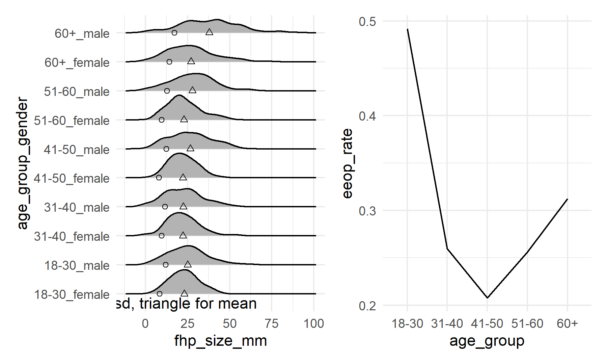

p8105\_mtp\_bg2715
================
Baode Gao

## Introduction

Australian researchers reported the relationship between human features
and the presence of enlarged external occipital protuberance in 2018.
They also thought using cell phone will cause horns" growth. This
project will verify the results in the original report by the data
accompanying the author correction.

## Problem 1

Import and clean the data.

``` r
eop_df = readxl::read_excel("./p8105_mtp_data.xlsx",  range = "A9:I1230") %>%
  janitor::clean_names() %>%
  rename(eop_size_type = eop_size) %>%
  replace_na(list(eop_size_mm = 0)) %>%
  replace_na(list(eop_shape = 0)) %>%
  filter((age_group %in% c(2,3,4,5,6,7,8)),
         (eop_size_type %in% c(0,1,2,3,4,5)),
         (fhp_category %in% c(0,1,2,3,4,5,6,7)),
         (eop_visibility_classification %in% c(0,1,2)),
         (sex %in% c(0,1))) %>%
  mutate(
    sex = recode(sex, "0" = "female", "1" = "male"
    ),
    age_group = recode(age_group, "2" = "18-30",
                       "3" = "31-40","4" = "41-50",
                       "5" = "51-60", "6" = "60+", 
                       "7" = "60+","8" = "60+"
    ),
    eop_size_type = recode(eop_size_type, "0" = "0-5",
                           "1" = "5-10",  "2" = "10-15",
                           "3" = "15-20", "4" = "20-25",
                           "5" = "25+"
    ),
    fhp_category = recode(fhp_category, "0" = "0-10", "1" = "10-20",
                          "2" = "20-30", "3" = "30-40",
                          "4" = "40-50", "5" = "50-60",
                          "6" = "60-70", "7" = "70-80"
    ),
    sex = factor(sex),
    age_group = factor(age_group),
    eop_size_type = factor(eop_size_type),
    eop_visibility_classification =
      factor(eop_visibility_classification),
    fhp_category = factor(fhp_category)
  )
```

I replaced the missing value by zero and converted categorical variables
from numeric variable to character and factors. Based on the paper, key
variables include ‘age’, ‘sex’ and ‘fhp\_category’. There are 1221
observations.

Age and gender distribution.

``` r
agesex_df = eop_df %>% 
  select(sex, age_group) %>% 
  group_by(age_group) %>% 
  count(sex, name = "count")
knitr::kable(agesex_df)
```

| age\_group | sex    | count |
|:-----------|:-------|------:|
| 18-30      | female |   151 |
| 18-30      | male   |   152 |
| 31-40      | female |   102 |
| 31-40      | male   |   102 |
| 41-50      | female |   106 |
| 41-50      | male   |   101 |
| 51-60      | female |    98 |
| 51-60      | male   |   101 |
| 60+        | female |   155 |
| 60+        | male   |   149 |

The number of participants in different gender have same trend within
age groups. The number of participants in 18-30 and 60+ age groups are
greater than other groups.

``` r
issues_df = 
  readxl::read_excel("./p8105_mtp_data.xlsx",  range = "A9:I1230") %>%
  janitor::clean_names() %>%
  rename(eop_size_type = eop_size) %>%
  replace_na(list(eop_size_mm = 0)) %>%
  replace_na(list(eop_shape = 0)) %>%
  filter(!(age_group %in% c(2,3,4,5,6,7,8))|
         !(eop_size_type %in% c(0,1,2,3,4,5))|
         !(fhp_category %in% c(0,1,2,3,4,5,6,7))|
         !(eop_visibility_classification %in% c(0,1,2))|
         !(sex %in% c(0,1))
           )
knitr::kable(issues_df)
```

| sex | age | age\_group | eop\_size\_mm | eop\_size\_type | eop\_visibility\_classification | eop\_shape | fhp\_size\_mm | fhp\_category |
|----:|----:|:-----------|--------------:|:----------------|--------------------------------:|-----------:|--------------:|:--------------|
|   0 |  17 | 1          |           6.4 | 1               |                               2 |          1 |          30.6 | 3             |
|   0 |  51 | 5          |           0.0 | 0               |                               0 |          0 |          30.3 | 30.8          |
|   1 |  62 | 6          |          15.0 | 14.6            |                               2 |          2 |          40.8 | 4             |
|   1 |  45 | 1          |           0.0 | 0               |                               0 |          0 |          42.0 | 4             |

There are two observations with ‘age\_group’ 1, one observation with
‘eop\_size\_type’ 14.6 and one observation with ‘fhp\_category’ 30.8,
which are meaningless.

## Problem 2

``` r
fig3 = eop_df %>% 
  mutate(age_group_gender = paste(age_group , sex, sep = '_')) %>%
  ggplot( aes(x = fhp_size_mm, y = age_group_gender)) + 
  geom_density_ridges(scale = .85) + 
  stat_summary(fun = mean, geom = "point", shape = 2) + 
  stat_summary(fun = sd, geom = "point", shape = 1) +
  annotate("text",x = 5,y = 0.7,label = "circle for sd, triangle for mean")

totalcount = eop_df %>% 
  count(age_group, name = "total_count")

fig4 = eop_df %>% 
  filter(eop_size_mm > 10) %>%
  count(age_group, name = "eeop_rate") %>%
  mutate(eeop_rate = eeop_rate/pull(totalcount,total_count)) %>%
  ggplot(aes(x = age_group, y = eeop_rate, group = 1)) +
  geom_line()

two_panel = fig3 + fig4
ggsave("two-panel.png")
```

    ## Saving 6 x 3.59 in image

    ## Picking joint bandwidth of 3.86

    ## Warning: Removed 6 rows containing non-finite values (stat_density_ridges).

    ## Warning: Removed 6 rows containing non-finite values (stat_summary).

    ## Warning: Removed 6 rows containing non-finite values (stat_summary).

``` r

```


``` r
fhp_eop_fig = eop_df %>% 
  ggplot(aes(x = fhp_size_mm, y = eop_size_mm, color = sex)) +
  geom_violin(aes(fill = sex)) +
  facet_grid(sex ~ age_group)

ggsave("fhp_eop_fig.png")
```

    ## Saving 6 x 3.59 in image

    ## Warning: Removed 6 rows containing non-finite values (stat_ydensity).

``` r
knitr::include_graphics("fhp_eop_fig.png")
```


Two-panel figure shows ‘age\_group’ is associated with ‘eeop\_rate’ and
‘fhp\_size\_mm’. ‘fhp\_eop\_fig’ shows ‘fhp\_size\_mm’ is associated
with ‘eeop\_rate’. Presuming ‘fhp\_size\_mm’ is exposure of interest and
‘eeop\_rate’ is the outcome. We know ‘age\_group’ is not in the causal
pathway between the exposure and outcome. i.e. ‘age\_group’ is the
potential confounder. What’s more, age and gender are associated with
the presence of EEOP.

## Problem 3

``` r
age_df = eop_df %>% 
  count(age_group, name = "count")
knitr::kable(age_df)
```

| age\_group | count |
|:-----------|------:|
| 18-30      |   303 |
| 31-40      |   204 |
| 41-50      |   207 |
| 51-60      |   199 |
| 60+        |   304 |

The authors’ stated sample sizes in each age group almost consistent
with the data I have. The biggest difference in the 41-50 ‘age\_group’.
My sample size in that group is seven more than the authors’.

``` r
eop_df %>% 
  group_by(sex) %>%
  summarise(mu = mean(fhp_size_mm, na.rm = TRUE),
    sd = sd(fhp_size_mm, na.rm = TRUE))
```

    ## # A tibble: 2 x 3
    ##   sex       mu    sd
    ##   <fct>  <dbl> <dbl>
    ## 1 female  23.7  10.6
    ## 2 male    28.5  14.7

Based on above computing on my data, the expectation of FHP size is 23.7
and 28.5 for female and male. The standard deviation of FHP size is 10.6
and 14.7 for female and male, respectively. Rounding this value, we can
get similar results as the authors did.

``` r
eop_df %>% 
  filter(eop_size_mm > 10) %>%
  nrow() / nrow(eop_df)
```

    ## [1] 0.3212818

Those bony outgrowths were named enlarged EOP (EEOP) only when they have
exceeded 10mm in size. I can use ‘fhp\_size\_mm’ and sample size to
evaluate. The prevalence of EEOP to be 32% in my data, which is close to
the authors’ one.

``` r
eop_df %>% 
  filter(fhp_size_mm > 40) %>%
  group_by(age_group) %>%
  summarise(proportion = n()) %>%
  mutate(total = pull(age_df, count),
         proportion = proportion / total) %>%
  select(-total)
```

    ## # A tibble: 5 x 2
    ##   age_group proportion
    ##   <fct>          <dbl>
    ## 1 18-30         0.0660
    ## 2 31-40         0.0588
    ## 3 41-50         0.0870
    ## 4 51-60         0.111 
    ## 5 60+           0.322

The broad trend is the same, and the specific value is 2.3% less.

## Problem 4

Based on above results, age, gender and FHP size play significant role
in predicting the presence of EEOP. It’s same as the results in the
original report. Our specific values are slight difference due to the
different data processing. I don’t think the data provide evidence that
cell phones are causing horn growth. To address it, we need data to
prove the relationship between using cell phone/posture and FHP size.
